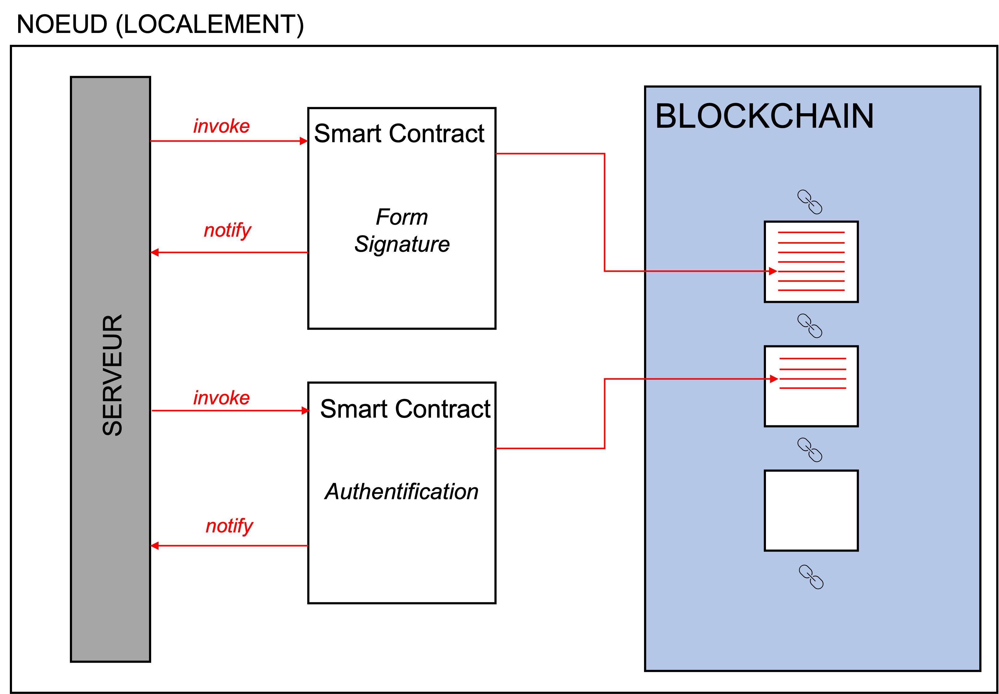

# En quoi la Blockchain s'inscrit dans BC-TA

Revenons à présent à notre problématique, il faut que notre système soit en mesure de faire 3 actions simples:

1. Authentifier les chercheurs des laboratoires
2. Permettre aux chercheurs de signer l’engagement
3. Garder l’historique de signatures et d’utilisation des données

Nous avons vu que nous pouvions avoir un historique avec les blocs mais il manque les conditions pour que l’historique se mette à jour (ce sont les 2 premiers points précédents). La solution qui s’offre à nous est l’utilisation de smart contracts. Les smarts contracts sont des codes qui s'exécutent sur la plateforme (decentralized computing). Lorsque les conditions sont vérifiées, les clauses s’activent et leurs résultats sont inscrits en tant qu’entrées dans un bloc de la blockchain.&#x20;

Il suffit donc que de 2 smart contracts pour vérifier les identifications et la signature de l’engagement. À noter que le smart contrat ne fait pas partie de la blockchain mais il interagit avec. Le schéma ci-dessous illustre cette interaction entre les deux.

