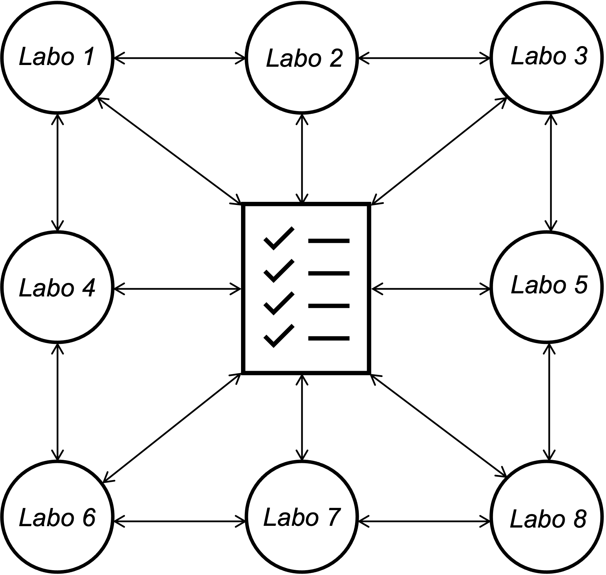
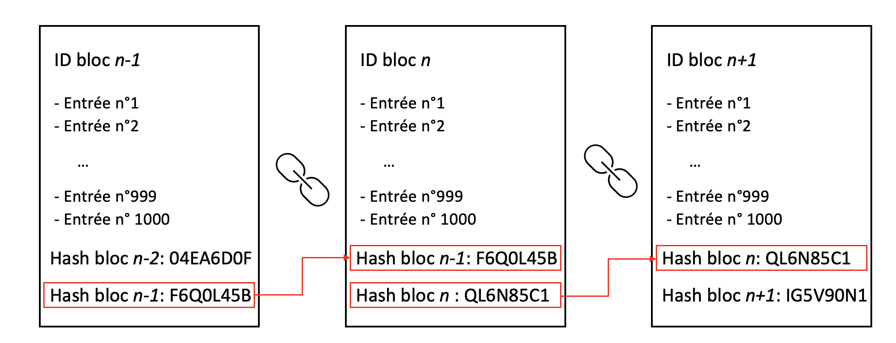

# Introduction à la Blockchain

L’objectif principal du projet BC-TA est de répondre à la problématique de gestion d’identité et d’accès pour les laboratoires (identity and access management, IAM).&#x20;

Pour comprendre en quoi la Blockchain peut répondre à cela, il faut d’abord comprendre le fonctionnement de la blockchain en tant que telle. Il faut voir cette dernière comme un registre décentralisé qui est distribué entre tous ses utilisateurs (des noeuds).&#x20;

Par exemple, en prenant le cas de Bitcoin, la Blockchain sert de livre de compte où l’ensemble des transactions y figurent et chaque utilisateur a accès à ce registre. C’est la première spécificité de la blockchain : elle est décentralisée. Il n’y a pas de tiers de confiance pour assurer la validité du registre, cette validité repose sur cette décentralisation.&#x20;

De ce fait, on est assuré de l'authenticité du registre car pour altérer le registre il faut l’altérer pour chaque nœud. Il existe plusieurs règles de validation de registre entre les nœuds, mais nous reviendrons sur ce principe un peu plus tard. Dans notre cas, chaque nœud de la blockchain sera un laboratoire qui aura accès à un registre qui permettra de retracer l’historique d’utilisation des jeux de données et l’historique de signature du formulaire d’engagement.

À la différence d’un registre papier ou toutes les entrées sont écrites sur des pages et lorsqu’une page est terminée on passe à la suivante, dans la blockchain les pages sont des blocs (d’où le nom).&#x20;

Un bloc peut contenir un certain nombre d’entrées et lorsqu’il est complet on a besoin de créer un nouveau bloc. Pour reprendre le cas de Bitcoin, chaque bloc peut contenir environ 2000 transactions.&#x20;

Se pose alors la question de numérotation de ces blocs : comment fait-on pour passer d’un bloc à un autre ? Pour un registre papier, la numérotation des pages permet de s’y retrouver facilement. L’équivalent dans la blockchain est un système d’identifiant de block. Chaque bloc va contenir, en plus des entrées, un identifiant. et un code hash. Le code hash est un code chiffré unique à chaque bloc qui dépend de l’identifiant, du contenu et du code hash du bloc précédent. Chaque bloc contient donc le code hash du bloc précédent ce qui permet de connaître l’ordre des blocs.

Lorsque l’on arrive à la fin d’un bloc, il faut donc créer un nouveau bloc en calculant le hash du bloc actuel pour pouvoir l’inscrire dans le nouveau bloc. Ce calcul est fait par l’ensemble des nœuds de la blockchain, lorsque le code est obtenu le bloc qui vient d’être terminé est proposée au reste des nœuds avec le code inscrit.&#x20;

À noter qu’il existe différentes configurations selon la blockchain utilisée. Par exemple, dans certaines blockchains n’importe quel nœud peut proposer un nouveau bloc, dans d’autres seuls certains nœuds peuvent en proposer. Nous expliquerons ultérieurement en quoi les différentes configurations peuvent être utilisées au profit de notre projet.
